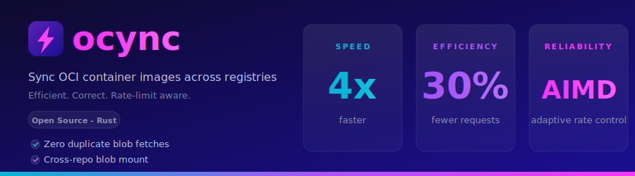

# ocync

Sync OCI container images across registries - efficiently.

<p align="center">
  
</p>

[](https://github.com/clowdhaus/ocync/actions/workflows/ci.yml)
[](https://opensource.org/licenses/Apache-2.0)
[](https://blog.rust-lang.org/2025/06/26/Rust-1.94.0.html)
[](https://gallery.ecr.aws/clowdhaus/ocync)

ocync copies container images between OCI registries with blob deduplication, cross-repo mounting, and streaming transfers. On real-world workloads it completes cold syncs 4x faster than comparable tools, with up to 30% fewer API requests, zero duplicate blob fetches across the run, and zero 429s on every benchmarked registry. See [Performance](https://clowdhaus.github.io/ocync/performance) for the full comparison.

ocync is purpose-built for one job: efficiently mirroring images from upstream registries (Docker Hub, GHCR, GAR, Chainguard) to a private registry (ECR, GAR, ACR). It is not a build tool, a registry, or a content rewriter - it copies bytes verbatim and lets the registry do its job. Multi-architecture indexes, manifests, blobs, and OCI 1.1 referrers (signatures, SBOMs, attestations) all flow through bit-for-bit.

## Features

- **Pure OCI Distribution API** - no Docker daemon, no shelling out, direct HTTPS to registries
- **Additive sync only** - never deletes; registries handle lifecycle and retention
- **Pipelined architecture** - discovery and execution overlap; no idle time between phases
- **Global blob deduplication** - shared layers across all images are transferred once per sync run
- **Cross-repo blob mounting** - leader-follower election ensures shared layers mount instead of re-upload
- **Streaming transfers** - bytes flow source to target with no intermediate disk (single-target mode)
- **Adaptive rate limiting** - per-(registry, action) [AIMD](https://clowdhaus.github.io/ocync/design/overview#adaptive-concurrency-aimd) (additive increase, multiplicative decrease) concurrency adapts to each registry's observed throttling, complemented by a token-bucket layer that enforces documented per-account TPS ceilings where the registry publishes them
- **Transfer state cache** - persistent cache skips already-synced blobs across runs
- **FIPS 140-3 by default** - aws-lc-rs with NIST Certificate #4816
- **Tag filtering** - glob patterns, semver ranges, exclude patterns, sort, latest-N
- **Platform filtering** - sync only the architectures you need (e.g., `linux/amd64`, `linux/arm64`)
- **Structured JSON output** - machine-readable sync reports for CI/CD pipelines
- **Graceful shutdown** - SIGINT/SIGTERM drains in-flight transfers within K8s termination window

## Quick start

Copy a single image:

```bash
ocync copy cgr.dev/chainguard/nginx:latest \
    123456789012.dkr.ecr.us-east-1.amazonaws.com/nginx:latest
```

For repeated syncs, use a config file. Two starting points cover most cases.

### Full-fidelity mirror (default)

Multi-arch indexes, signatures, and SBOMs are preserved bit-for-bit. Use this for compliance and any workload that cares about supply-chain provenance.

```yaml
registries:
  source: { url: ghcr.io }
  ecr:    { url: 123456789012.dkr.ecr.us-east-1.amazonaws.com }

defaults:
  source: source
  targets: ecr

mappings:
  - from: my-org/my-app
    to: my-app
    tags:
      semver: ">=1.0"
      sort: semver
      latest: 5
```

### Minimum bytes

Use this for CI mirrors and air-gapped fleets that do not verify signatures. Skip the OCI 1.1 referrers and narrow to the tags you actually need; multi-arch indexes still flow through verbatim.

```yaml
registries:
  source: { url: cgr.dev }
  ecr:    { url: 123456789012.dkr.ecr.us-east-1.amazonaws.com }

defaults:
  source: source
  targets: ecr
  artifacts:
    enabled: false       # skip cosign signatures, SBOMs, attestations
  tags:
    glob: ["latest"]

mappings:
  - from: chainguard/curl
    to: curl
```

Run a sync, or preview what would change:

```bash
ocync sync -c config.yaml
ocync sync -c config.yaml --dry-run
```

See [Recipes](https://clowdhaus.github.io/ocync/recipes/production-mirror) for variant-only mirrors, helm-chart-and-images patterns (ArgoCD, cert-manager, Karpenter), semver release tracking, and more.

## Installation

<details>
<summary>Binary releases</summary>

Download from [GitHub Releases](https://github.com/clowdhaus/ocync/releases):

| Platform | Binary | FIPS |
|---|---|---|
| Linux x86_64 | `ocync-fips-linux-amd64` | Yes |
| Linux arm64 | `ocync-fips-linux-arm64` | Yes |
| macOS arm64 | `ocync-macos-arm64` | No |
| Windows x86_64 | `ocync-windows-amd64.exe` | No |

Linux binaries are statically linked with FIPS 140-3 validated cryptography.

</details>

<details>
<summary>Docker</summary>

```bash
docker pull public.ecr.aws/clowdhaus/ocync:latest-fips
```

Multi-arch image (`linux/amd64`, `linux/arm64`) based on `chainguard/static`.

</details>

<details>
<summary>Helm</summary>

```bash
helm install ocync oci://public.ecr.aws/clowdhaus/ocync --version 0.1.0
```

Supports Deployment (watch), CronJob, and Job modes. See the [Helm chart docs](https://clowdhaus.github.io/ocync/helm).

</details>

<details>
<summary>Build from source</summary>

```bash
# FIPS build (default, requires CMake + Go + Perl)
cargo install --locked ocync

# Non-FIPS build (no extra dependencies)
cargo install --locked ocync --no-default-features --features non-fips
```

Minimum Rust version: 1.94 (edition 2024).

</details>

## Documentation

Full documentation at [clowdhaus.github.io/ocync](https://clowdhaus.github.io/ocync):

- [Getting started](https://clowdhaus.github.io/ocync/getting-started) - installation, first sync, key concepts
- [Configuration](https://clowdhaus.github.io/ocync/configuration) - config file reference
- [Recipes](https://clowdhaus.github.io/ocync/recipes/production-mirror) - common mirror patterns (production, minimum bytes, helm + images, variant filtering, semver tracking)
- [CLI reference](https://clowdhaus.github.io/ocync/cli-reference) - commands, flags, exit codes
- [Registry guides](https://clowdhaus.github.io/ocync/registries/ecr) - ECR, Docker Hub, GHCR, GAR, ACR, Chainguard
- [Helm chart](https://clowdhaus.github.io/ocync/helm) - Kubernetes deployment
- [Performance](https://clowdhaus.github.io/ocync/performance) - benchmarks and architecture
- [FIPS 140-3](https://clowdhaus.github.io/ocync/fips) - compliance details

## Supported registries

| Registry | Auth | Blob mount | Notes |
|---|---|---|---|
| Amazon ECR (private) | IAM (automatic) | Yes (opt-in) | Batch APIs, per-action rate limits |
| Amazon ECR Public | IAM (automatic) | No | Separate auth from private ECR |
| Chainguard | Token exchange | N/A (source) | No rate limits |
| Docker Hub | Docker config / static | Yes | 10/hr anon, 100/6hr auth manifest GETs; blob GETs unmetered |
| GitHub Container Registry | Docker config | Yes | Single-PATCH upload fallback |
| Google Artifact Registry | Docker config | Yes | Monolithic upload only |
| Azure Container Registry | Docker config | Yes | Streaming PUT (chunked upload planned) |
| Any OCI-compliant registry | Basic / token / anonymous | Varies | Auto-detected |

## License

Apache-2.0
